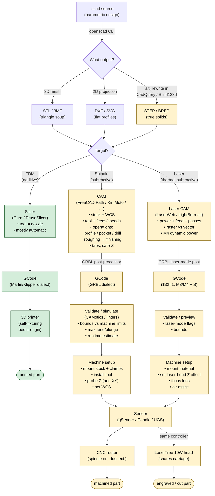

# cnc_for_the_scad

A guide for software engineers who already know OpenSCAD + FDM 3D printing and want to make their CNC router cut holes in things — not print plastic in the shape of "thing-with-holes."

> Status: **v1 — concepts and pipeline only.** Machine-specific commands, stack recommendation, and automation scaffolding land in later versions as we work through each decision together.

---

## 1. The shift you're making

In FDM, the slicer is nearly fully automatic because the tool is a *point* that deposits material. Geometry → STL → slicer → GCode is a one-way pipeline with sane defaults at every stage. You barely think about the toolhead because it has only one degree of geometric freedom (nozzle diameter) and one job (extrude here, don't extrude there).

In subtractive CNC, the tool is a *shape* (cylindrical endmill, ball-end, V-bit, …) that *removes* material from a piece of stock that has its own shape, held to a machine that has its own coordinate system, in a way that has to respect rigidity, chip evacuation, heat, and the fact that mistakes can break expensive things or throw debris. The "slicer" equivalent — called **CAM** (Computer-Aided Manufacturing) — does not have sane defaults. *You* tell it what tool, how fast to spin it, how fast to feed it, how deep to take each pass, how wide to step over, in what order to do the operations, and where the part is held on the machine. Then CAM schedules the toolpaths and emits GCode.

This is not because CAM tools are primitive. It's because the decisions are inherently per-job and per-material, and getting them wrong has physical consequences slicers don't have to worry about.

The good news: your most common use case — "cut a hole / pocket / outline in a flat sheet of wood" — only needs a small subset of these decisions, and most of them can be templated and reused. The rest of this guide builds toward making that case fast and the harder cases possible.

---

## 2. Industry vocabulary you need

These terms are universal across FreeCAD Path, Fusion, Mastercam, Kiri:Moto, pycam, etc. Learn them once and the tool-specific UI/CLI surfaces become readable.

### 2.1 Setup concepts

- **Stock.** The raw piece of material you start with. CAM needs to know its bounds and origin so it can plan rapid moves that don't crash into it and clearance moves that clear it.
- **Workholding / fixturing.** How the stock is held to the machine bed: clamps, T-track hardware, double-sided tape, vacuum table, screws. Drives what areas of the part the tool cannot reach (clamps are obstacles) and how aggressive you can be (a wiggly part chatters or rips loose).
- **Work coordinate system (WCS).** Where, on the physical stock, is X=0, Y=0, Z=0? Unlike FDM (where the bed's front-left corner is always origin), in CNC *you* pick it per job — often a corner of the stock, or the center of a feature. Stored in GRBL as G54–G59. Setting the WCS is called "zeroing" or "touching off."
- **Tool length offset / Z-zero.** Where is the *tip* of the tool relative to your WCS Z=0? Determined by jogging the tool down until it touches the work surface (paper-feeler) or — much better — by **probing** with a touch plate that closes a circuit when contacted. You have a probe, so use it.
- **Safe Z / clearance plane.** The Z height that rapid (G0) moves use to traverse without hitting anything. Set above your tallest clamp/fixture, not just above the stock.

### 2.2 The tool itself

- **Endmill** (flat-end): the workhorse. Cuts on the bottom and the sides. Diameter determines minimum internal corner radius (a 3mm endmill cannot make a 2mm-radius inside corner — geometry forbids it).
- **Ball-end mill:** rounded tip, used for 3D contour finishing because it leaves a uniform scallop pattern.
- **V-bit:** conical, used for V-carving text/decorative inlays and for chamfers.
- **Flutes:** the cutting edges spiraling up the tool. More flutes = more chip-removal per revolution but less chip clearance — wood likes 1–2 flutes, aluminum likes 2–3, steel likes 3–4.
- **Up-cut / down-cut / compression:** spiral direction. Up-cut pulls chips up (good chip evacuation, splinters the top edge of wood). Down-cut pushes chips down (clean top edge, packs chips into the cut — fire risk if you go too deep). Compression does both.

### 2.3 The motion

- **Feed rate (F).** Linear speed of the tool through the material, mm/min. Too slow burns/melts; too fast snaps the tool or stalls the spindle.
- **Spindle speed (S).** RPM. With your 500W spindle, expect 8000–24000 RPM range — check the actual spec when we do machine research.
- **Chipload.** The bite-per-tooth, mm. The fundamental cutting parameter. Relationship: `feed = chipload × flutes × rpm`. Material+tool tables give you chipload; you derive feed.
- **Depth of cut (DOC) / stepdown.** How deep each pass goes (Z). Usually expressed as fraction of tool diameter: ≤1×D for soft wood with a flat endmill, much less for hardwood/aluminum.
- **Width of cut (WOC) / stepover.** How much of the tool's diameter is engaged sideways. ~40–50% for general roughing, smaller for finishing.
- **Climb vs conventional milling.** Direction of tool rotation relative to feed direction. On a rigid machine with no backlash, climb cutting gives better surface finish; on a wobbly machine it can grab and pull. Your machine has ball screws (very low backlash), so climb is generally fine.

### 2.4 Operations

Almost any 2.5D job is one or more of:

- **Profile / contour.** Cut along a 2D curve at some depth. Critical detail: the toolpath is *offset* from the geometry by the tool radius. Cutting a 10mm-diameter hole with a 3mm endmill means the toolpath is a 3.5mm-radius circle (10/2 − 3/2). Cutting the *outside* of a 100mm square offsets outward. CAM does this for you, but you tell it inside/outside/on.
- **Pocket.** Clear out the area enclosed by a 2D curve down to a depth. CAM picks a strategy (offset spiral, zigzag, adaptive/trochoidal).
- **Drill.** Single-point holes at coordinates. Often "peck drilled" — plunge, retract, plunge deeper, retract — to clear chips.
- **Engrave / V-carve.** Trace lines (raster or vector). With a V-bit and varying Z, you get the classic "carved sign" look where line width = depth.
- **Surface / 3D contour.** Parallel passes following a 3D surface. Usually preceded by a roughing pass that leaves uniform stock for finishing to remove.
- **Adaptive clearing / trochoidal.** Modern roughing strategy that keeps the tool's engagement angle constant by using curved looping motion. Lets you push DOC much deeper at lower WOC. Worth learning once you outgrow simple pocketing.

### 2.5 Things that exist in CNC and not in FDM

- **Tabs / bridges.** When you profile-cut a part fully through a sheet, the part will fall, move, and get hit by the spinning tool. Tabs leave small uncut sections of stock holding the part in place; you finish with a knife or sand them off.
- **Roughing vs finishing.** Take material out fast and ugly, then take a light pass for surface quality. FDM has no analogue — every layer is already a "finish" pass.
- **Stock-to-leave / allowance.** The roughing pass intentionally leaves N millimeters of stock everywhere for finishing to remove.
- **Tool change.** Multiple operations may need different tools. GRBL does not implement automatic tool change (M6) — the convention is to pause (M0), let the user swap tools manually, re-probe Z, and resume.
- **Post-processor.** CAM produces a generic internal toolpath; the post-processor formats it into the GCode dialect your controller speaks. GRBL has specific limits (e.g. arc precision, no canned cycles, "laser mode" interactions). Picking the right post is essential.

### 2.6 Laser-specific

Most of the above doesn't apply to the laser head. Lasers have:

- **Power (S in laser mode).** Replaces both spindle speed and depth of cut.
- **Feed rate.** How fast you traverse — slower = more heat = deeper cut / darker burn.
- **Passes.** Number of times to repeat — depth comes from repetition, not from Z motion.
- **M3 vs M4 in GRBL laser mode.** `$32=1` enables laser mode. `M4` makes laser power scale with feed rate, so corners (where the tool slows to change direction) don't over-burn. Use `M4` for engraving, `M3` for steady cuts.
- **Focus.** The lens is at a fixed focal length from the material. Z-zeroing means setting that focal distance, not touching the surface like a spindle.
- **Air assist.** Compressed air at the nozzle blows smoke/debris out of the cut. Optional but transformative for cut cleanliness on wood. Worth budgeting for.

---

## 3. The pipeline, as a diagram

This shows what happens from `.scad` source to a finished part, with the fork between additive (what you know) and the two subtractive modes you're learning. Stages are roughly the "files" or "tools" in a software pipeline; arrows are transformations.



(Green = familiar from FDM. Yellow = new territory.)

The two key shape-changes from the FDM pipeline you know:

1. **The geometry export branches** because CAM tools want different inputs depending on what you're doing. For 2.5D ("cut a hole in a sheet"), 2D profiles via OpenSCAD's `projection()` → DXF is often cleaner than feeding a mesh through CAM. For 3D contouring, mesh (STL) is acceptable but B-rep (STEP) is preferable.
2. **There's a setup stage between GCode and machine** that has no analogue in FDM. The same GCode file produces totally different physical results depending on where you set the WCS, what tool is in the spindle, and what stock is on the bed. The GCode is necessary but not sufficient — the setup is data too.

The **shared sender** node is worth noting: both spindle jobs and laser jobs go through the same controller and the same sender software. The spindle/laser difference lives in the GCode (M3/M4 + S commands behave differently when `$32=1` is set) and in the physical setup (which head is energized, what's on the bed, where Z=0 is).

---

## 4. The "cut a hole in a sheet of something" common case

To make this concrete, here's what the pipeline collapses to for your most common job:

1. Write `.scad` with the 2D shape (or 3D shape whose top-down silhouette is the cut).
2. Export DXF via `openscad -o part.dxf --export-format dxf part.scad` (using `projection(cut=true)` for a slice, or `projection()` for the silhouette).
3. Load DXF into CAM. Define stock (sheet thickness, material). Pick endmill. Configure **one** operation: profile cut with tabs, total depth = sheet thickness + 0.2mm (overcut into the spoilboard for clean break-through).
4. Post-process to GRBL GCode.
5. Validate: bounds inside machine limits, max feed reasonable, plunge depth doesn't try to drive the tool into the spoilboard at G0.
6. On machine: clamp sheet to spoilboard, install endmill, probe Z on top of stock, set X/Y to a corner of the stock.
7. Send via gSender. Run dust collection. Cut.

Almost every parameter in step 3 is a function of (material, tool, machine) — meaning it's templatable. That's where automation gives the most value, and where we'll focus first.

---

## 5. What we're deciding next

Open questions, in order of impact on the rest of this document:

- **5.1** What controller / firmware does the Anolex 4030-Evo Ultra 2 actually ship with, and what sender does its community use? This determines the GCode dialect we target and the post-processor we pick.
- **5.2** What CAM stack do we standardize on? Candidates to compare: FreeCAD Path (workbench, scriptable from Python), Kiri:Moto (browser, self-hostable, has a headless mode), pycam (Python, was unmaintained for years — need to verify status), CAMotics (primarily a simulator, generator-light). Comparison criteria: open-source license, CLI/headless story, GRBL post quality, 2.5D and 3D coverage, laser support, active maintenance in 2026.
- **5.3** SCAD-to-CAM bridge: confirm OpenSCAD's current STEP/BREP export status; evaluate whether `projection() → DXF` covers the common case well enough that CadQuery is only needed for 3D parts; spot-check CadQuery and Build123d for code-first sanity.
- **5.4** Automation depth: based on the chosen stack, recommend the lightest layer of scripts + tests that catches real classes of bugs (machine-limit overshoots, missing tabs, wrong WCS, laser-mode flag missing from spindle jobs, etc).

Each of these gets researched in turn and folded into this document. Sections 5.1–5.4 become real sections; this list goes away.

---

## 6. Repo layout (planned)

```
cnc_vibes/
├── cnc_for_the_scad.md   ← this file
├── examples/             ← .scad sources for templates (hole-in-sheet, pocket, sign)
├── profiles/             ← machine + material + tool parameter sets (yaml)
├── scripts/              ← scad→dxf/stl, dxf→gcode, validators
├── tests/                ← interface tests (bounds, feeds, dialect checks)
└── Makefile              ← reproducible per-job builds
```

Nothing is built yet. The shape will firm up once §5.2 and §5.4 are decided.
