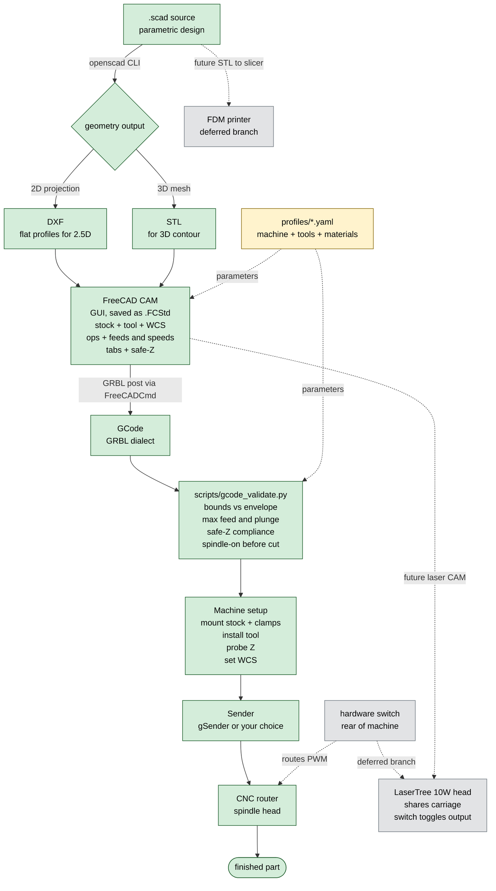
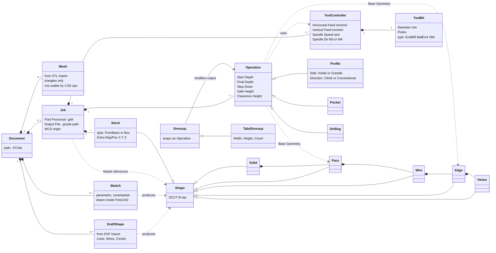

# cnc_for_the_scad

A guide for software engineers who already know OpenSCAD + FDM 3D printing and want to make their CNC router cut holes in things — not print plastic in the shape of "thing-with-holes."

> **Status: v2.** Spindle-only this iteration. Laser and FDM are deferred but the architecture accommodates them as additional pipeline branches (see §3 and §4). CAM tool is **FreeCAD's CAM workbench**; geometry export + GCode validation are CLI; CAM setup itself is GUI.

---

## 1. The shift you're making

In FDM, the slicer is nearly fully automatic because the tool is a *point* that deposits material. Geometry → STL → slicer → GCode is a one-way pipeline with sane defaults at every stage. You barely think about the toolhead because it has only one degree of geometric freedom (nozzle diameter) and one job (extrude here, don't extrude there).

In subtractive CNC, the tool is a *shape* (cylindrical endmill, ball-end, V-bit, …) that *removes* material from a piece of stock that has its own shape, held to a machine that has its own coordinate system, in a way that has to respect rigidity, chip evacuation, heat, and the fact that mistakes can break expensive things or throw debris. The "slicer" equivalent — called **CAM** (Computer-Aided Manufacturing) — does not have sane defaults. *You* tell it what tool, how fast to spin it, how fast to feed it, how deep to take each pass, how wide to step over, in what order to do the operations, and where the part is held on the machine. Then CAM schedules the toolpaths and emits GCode.

This is not because CAM tools are primitive. It's because the decisions are inherently per-job and per-material, and getting them wrong has physical consequences slicers don't have to worry about.

The good news: your most common use case — "cut a hole / pocket / outline in a flat sheet of wood" — only needs a small subset of these decisions, and most of them can be templated and reused. The rest of this guide builds toward making that case fast and the harder cases possible.

---

## 2. Industry vocabulary you need

These terms are universal across FreeCAD, Fusion, Mastercam, Kiri:Moto, pycam, etc. Learn them once and the tool-specific UI/CLI surfaces become readable.

### 2.1 Setup concepts

- **Stock.** The raw piece of material you start with. CAM needs to know its bounds and origin so it can plan rapid moves that don't crash into it and clearance moves that clear it.
- **Workholding / fixturing.** How the stock is held to the machine bed: clamps, T-track hardware, double-sided tape, vacuum table, screws. Drives what areas of the part the tool cannot reach (clamps are obstacles) and how aggressive you can be (a wiggly part chatters or rips loose).
- **Work coordinate system (WCS).** Where, on the physical stock, is X=0, Y=0, Z=0? Unlike FDM (where the bed's front-left corner is always origin), in CNC *you* pick it per job — often a corner of the stock, or the center of a feature. Stored in GRBL as G54–G59. Setting the WCS is called "zeroing" or "touching off."
- **Tool length offset / Z-zero.** Where is the *tip* of the tool relative to your WCS Z=0? Determined by jogging the tool down until it touches the work surface (paper-feeler) or — much better — by **probing** with a touch plate that closes a circuit when contacted. You have a probe, so use it.
- **Safe Z / clearance plane.** The Z height that rapid (G0) moves use to traverse without hitting anything. Set above your tallest clamp/fixture, not just above the stock.

### 2.2 The tool itself

- **Endmill** (flat-end): the workhorse. Cuts on the bottom and the sides. Diameter determines minimum internal corner radius (a 3mm endmill cannot make a 2mm-radius inside corner — geometry forbids it).
- **Ball-end mill:** rounded tip, used for 3D contour finishing because it leaves a uniform scallop pattern.
- **V-bit:** conical, used for V-carving text/decorative inlays and for chamfers.
- **Flutes:** the cutting edges spiraling up the tool. More flutes = more chip-removal per revolution but less chip clearance — wood likes 1–2 flutes, aluminum likes 2–3, steel likes 3–4.
- **Up-cut / down-cut / compression:** spiral direction. Up-cut pulls chips up (good chip evacuation, splinters the top edge of wood). Down-cut pushes chips down (clean top edge, packs chips into the cut — fire risk if you go too deep). Compression does both.

### 2.3 The motion

- **Feed rate (F).** Linear speed of the tool through the material, mm/min. Too slow burns/melts; too fast snaps the tool or stalls the spindle.
- **Spindle speed (S).** RPM. Defined per-machine in your profile (§4).
- **Chipload.** The bite-per-tooth, mm. The fundamental cutting parameter. Relationship: `feed = chipload × flutes × rpm`. Material+tool tables give you chipload; you derive feed.
- **Depth of cut (DOC) / stepdown.** How deep each pass goes (Z). Usually expressed as fraction of tool diameter: ≤1×D for soft wood with a flat endmill, much less for hardwood/aluminum.
- **Width of cut (WOC) / stepover.** How much of the tool's diameter is engaged sideways. ~40–50% for general roughing, smaller for finishing.
- **Climb vs conventional milling.** Direction of tool rotation relative to feed direction. On a rigid machine with no backlash, climb cutting gives better surface finish; on a wobbly machine it can grab and pull. Ball-screw machines (yours) tolerate climb well.

### 2.4 Operations

Almost any 2.5D job is one or more of:

- **Profile / contour.** Cut along a 2D curve at some depth. Critical detail: the toolpath is *offset* from the geometry by the tool radius. Cutting a 10mm-diameter hole with a 3mm endmill means the toolpath is a 3.5mm-radius circle (10/2 − 3/2). Cutting the *outside* of a 100mm square offsets outward. CAM does this for you, but you tell it inside/outside/on.
- **Pocket.** Clear out the area enclosed by a 2D curve down to a depth. CAM picks a strategy (offset spiral, zigzag, adaptive/trochoidal).
- **Drill.** Single-point holes at coordinates. Often "peck drilled" — plunge, retract, plunge deeper, retract — to clear chips.
- **Engrave / V-carve.** Trace lines (raster or vector). With a V-bit and varying Z, you get the classic "carved sign" look where line width = depth.
- **Surface / 3D contour.** Parallel passes following a 3D surface. Usually preceded by a roughing pass that leaves uniform stock for finishing to remove.
- **Adaptive clearing / trochoidal.** Modern roughing strategy that keeps the tool's engagement angle constant by using curved looping motion. Lets you push DOC much deeper at lower WOC. Worth learning once you outgrow simple pocketing.

### 2.5 Things that exist in CNC and not in FDM

- **Tabs / bridges.** When you profile-cut a part fully through a sheet, the part will fall, move, and get hit by the spinning tool. Tabs leave small uncut sections of stock holding the part in place; you finish with a knife or sand them off.
- **Roughing vs finishing.** Take material out fast and ugly, then take a light pass for surface quality. FDM has no analogue — every layer is already a "finish" pass.
- **Stock-to-leave / allowance.** The roughing pass intentionally leaves N millimeters of stock everywhere for finishing to remove.
- **Tool change.** Multiple operations may need different tools. GRBL does not implement automatic tool change (M6) — the convention is to pause (M0), let the user swap tools manually, re-probe Z, and resume.
- **Post-processor.** CAM produces a generic internal toolpath; the post-processor formats it into the GCode dialect your controller speaks. GRBL has specific limits (e.g. arc precision, no canned cycles, "laser mode" interactions). Picking the right post is essential.

---

## 3. The pipeline



Green = live in this iteration. Yellow = configuration parameters that feed multiple stages. Grey/dashed = designed-for but not yet implemented.

Three things worth calling out:

1. **The geometry export branches** because CAM tools want different inputs for different jobs. For 2.5D ("cut a hole in a sheet"), `projection()` → DXF is cleaner than feeding a mesh through CAM. For 3D contouring, STL is acceptable.
2. **There's a setup stage between GCode and machine** that has no analogue in FDM. The same GCode file produces totally different physical results depending on where you set the WCS, what tool is in the spindle, and what stock is on the bed. The GCode is necessary but not sufficient — the setup is data too.
3. **The hardware switch on the back of your machine** routes the GRBL spindle PWM signal to either the spindle controller or the laser TTL input. This is why laser support is a *branch* of the pipeline rather than a separate parallel pipeline: same controller, same sender, same GCode dialect, with a different post-processor and a physical switch flip. The future laser branch will hook in at the CAM stage and require a flag on the per-job config so the validator knows which head it's targeting.

---

## 4. The machine (and tools, and materials) as configuration

A foundational principle of this repo: **nothing about your specific machine should be hardcoded.** The guide and the automation target *a GRBL 1.1+ class router described by a profile*. Replacing the machine means swapping a YAML file, not editing scripts.

The profile lives at `profiles/anolex_4030_evo_ultra2.yaml` and follows this shape (placeholder values flagged with `# TODO` — fill in from your machine's documentation, gSender's status screen, or by running `$$` in your sender):

```yaml
name: Anolex 4030-Evo Ultra 2
controller:
  dialect: grbl-1.1+
  laser_mode_setting: 32     # $32 — set to 1 for laser, 0 for spindle
envelope_mm:
  x: 400
  y: 300
  z: 100                     # TODO: confirm from manual
max_feed_mm_per_min:
  xy: 3000                   # TODO: confirm
  z:  1000                   # TODO: confirm
spindle:
  rpm_min: 8000              # TODO: confirm
  rpm_max: 24000             # TODO: confirm
  control: pwm               # M3/M5 + S0-1000 via GRBL
probe:
  has_touch_plate: true
  thickness_mm: 0.0          # TODO: measure your plate
heads:
  primary: spindle
  secondary: laser           # deferred from this iteration
  switch: rear_hardware      # physical toggle on machine rear
```

**Tools** (`profiles/tools.yaml`) and **materials** (`profiles/materials.yaml`) follow the same principle. Tools define geometry + max RPM + max plunge rate. Materials define recommended chipload per tool diameter and recommended DOC fractions. The validator (§5) cross-references all three.

This is what "parameterize the machine" buys you: when you upgrade the spindle, or move to a different router, or someone forks this repo for *their* GRBL machine, the only file that changes is the profile.

---

## 5. CAM tool: FreeCAD

Of the open-source CAM options, **FreeCAD's CAM workbench** is the right pick for this workflow because:

- It's open source (LGPL), self-hosted, no online dependency.
- It handles 2.5D (profiles, pockets, drilling, engraving), 3D contouring with roughing+finishing, and tool tables.
- It ships with a GRBL post-processor; you don't need to write your own GCode formatter.
- It has a Python API: while you set up jobs in the GUI, you can post-process them from the command line via `FreeCADCmd`, which means GCode generation is a Make target — re-runnable, deterministic, CI-friendly.
- It saves the entire job (stock, tools, operations, parameters) in a single `.FCStd` file that you check into the repo alongside the `.scad` source. The setup is version-controlled.

The split is:

| Step | Tool | Reason |
|---|---|---|
| Geometry export | OpenSCAD CLI | Deterministic, scriptable, no GUI needed |
| CAM setup (once per part) | FreeCAD CAM GUI | Inherently visual — defining stock, picking edges, configuring ops |
| GCode generation (every time inputs change) | FreeCAD CLI (`FreeCADCmd`) | Deterministic re-post from the saved `.FCStd` |
| Validation | Python script | Mechanical checks against the machine profile |
| Sending to machine | gSender (or your sender of choice) | GUI is fine here — you're watching the machine anyway |

The CAM setup is the *only* step that requires clicking. Everything else is `python cnc.py <subcommand>` (see §7 for setup).

### 5.1 FreeCAD's object model (the bits we touch)

FreeCAD is built around a small set of object types that compose into a tree inside a `.FCStd` Document. The click-through in §6 names a lot of these — this diagram is the reference map. Reading it once now will make the step-by-step feel less like memorization.



**How to read it, mapped to the click-through:**

- **Document** is the `.FCStd` file you save in step 1. Everything else lives inside it.
- **DraftShape** is what `File → Import` produces from your DXF — a flat set of wires, lines, and circles on the XY plane. **Sketch** is the alternative: a parametric 2D sketch you'd draw inside FreeCAD, used when you don't have external geometry. **Mesh** is what an STL import produces; it can feed 3D Surface operations but not the 2.5D Profile op we use here, which is why our pipeline exports DXF for 2.5D and STL only for 3D contour work.
- The **B-rep hierarchy** (Shape ← Solid/Face/Wire/Edge/Vertex) is OpenCascade's geometry model. Every visible object in FreeCAD ultimately decomposes into this tree. The reason it matters for CAM: when step 6 says "pick the eight circle edges," you're literally selecting `Edge` objects out of the DraftShape's wire tree, and the Profile op stores references to those Edges as its **Base Geometry**.
- **Job** (step 2) is the CAM root. It owns one **Stock** (step 3), one or more **ToolController**s (step 5, each wrapping a **ToolBit** with feeds and speeds), and one or more **Operation**s (step 6). It also holds the Post Processor name and output file path (step 8).
- **Operation** is abstract — the concrete subclasses you'll see in the tree are `Profile`, `Pocket`, `Drilling`. Each Operation references a single ToolController (so changing a feed rate updates every op that uses that tool) and an arbitrary number of Base Geometry edges/faces. The hole_in_sheet example uses two `Profile` instances because `Side` is an Operation-level property, not per-edge.
- **Dressup** is FreeCAD's "decorator pattern": a wrapper that sits on top of an Operation and modifies the toolpath it emits. `TabsDressup` (step 7) is the one you'll use most; others exist (Boundary Compensation, Lead In/Out) but aren't needed for the example.

When you re-open the saved `.FCStd` after a SCAD change, FreeCAD walks this tree to regenerate toolpaths. The Job → Stock → Operation references follow the geometry that was updated by the DXF reimport, so most parameter changes don't require any clicks beyond `Post Process`.

---

## 6. The "cut a hole in a sheet" worked example

This is in `examples/hole_in_sheet/`. The flow:

1. **Design.** Edit `hole_in_sheet.scad`. It's parametric on sheet size, sheet thickness, and hole grid.
2. **Export geometry.** `python cnc.py build hole_in_sheet` runs OpenSCAD twice — once with `-D 'mode="dxf"'` to produce the 2D `projection()`, once for the STL — and writes both into `examples/hole_in_sheet/build/`.
3. **First time only — CAM setup in FreeCAD.** Open FreeCAD, import the DXF, create a Path Job, define stock from the sheet dimensions, pick a tool (from your tool table), add a Profile operation with tabs, configure feeds/speeds/DOC referencing your material spec. Save as `hole_in_sheet.FCStd` in the example directory. *This is the one step the guide can't automate — it's data entry that benefits from visual feedback.* See the **[click-through detail](#click-through-hole_in_sheet-cam-setup-in-freecad)** below for the exact clicks.
4. **Iterate.** When you change `hole_in_sheet.scad` (different hole size, more holes, etc), re-run `python cnc.py build hole_in_sheet`. The DXF regenerates; FreeCAD picks up the new geometry on next open; you re-post to GCode.
5. **Validate.** `python cnc.py validate examples/hole_in_sheet/build/hole_in_sheet.gcode` runs `scripts/gcode_validate.py` using your machine profile and tool table. Catches bounds violations, feed overruns, missing safe-Z compliance.
6. **Cut.** Clamp the sheet, install the endmill, probe Z (the touch plate compensates for tool length), set X/Y origin to the corner of the stock that matches your CAM WCS, run dust collection, send via gSender.

Almost every parameter you set in step 3 is a function of (material, tool, machine) — meaning it's templatable. Future iterations can lean on FreeCAD's Python API to generate jobs from templates so even step 3 collapses for repeat patterns.

<details>
<summary><b>Click-through: hole_in_sheet CAM setup in FreeCAD</b> (one-time, ~10–15 min)</summary>

Written against current FreeCAD (CAM workbench). The FreeCAD wiki has screenshots of every dialog mentioned here: <https://wiki.freecad.org/CAM_Workbench>.

Assumes you've already run `python cnc.py build hole_in_sheet` and have the DXF on disk. The example's defaults: part is 200 × 100 × 6 mm; stock is 220 × 120 × 6 mm (10 mm extra on each X/Y side, same thickness as the part).

**Coordinate convention used below** (pick this once for the whole repo so every job lines up the same way):

- **WCS X=0, Y=0** = front-left corner of the **stock** — i.e. the corner of the physical sheet you'll clamp. The part sits 10 mm in +X and 10 mm in +Y from this corner.
- **WCS Z=0** = top of stock. Cuts go negative.

You'll match this on the machine by touching off X/Y on the front-left corner of the sheet and probing Z on the top.

---

##### 1. Open and import

1. Launch FreeCAD.
2. **File → New** to create an empty document.
3. **File → Save As…** → save as `examples/hole_in_sheet/hole_in_sheet.FCStd` in this repo.
4. **File → Import** → select `examples/hole_in_sheet/build/hole_in_sheet.dxf`.
   - Accept the import defaults (Draft shapes).
   - Result: a set of Draft wires on the XY plane at Z=0 — one closed rectangle (the sheet outline) and eight closed circles (the holes).
5. Press `0` to fit view, then `2` for top view.

##### 2. Create the Job

1. Switch to the **CAM** workbench (workbench selector, top-left).
2. **CAM → Job** opens the Job creation dialog.
3. In the dialog:
   - **Base objects:** select all the imported Draft shapes (the rectangle and circles).
   - **Template:** leave empty (or pick one of your saved templates once you have them).
   - Click **OK**.

A `Job` object appears in the tree with sub-folders `Model`, `Stock`, `Operations`, `Tools`. The Job-Edit panel opens automatically; if not, double-click the Job.

##### 3. Configure Stock

1. In Job-Edit, **Stock** tab → **Stock type:** *Create Box from base bounding box*.
2. **Extra dimensions:**
   - `Neg. X` = **10**, `Pos. X` = **10**
   - `Neg. Y` = **10**, `Pos. Y` = **10**
   - `Neg. Z` = **6**, `Pos. Z` = **0**
   - The DXF wires are flat at Z=0; we tell the Stock to extend 6 mm downward so it represents the 6 mm sheet sitting at Z = −6..0.
3. Confirm the displayed stock dimensions read **220 × 120 × 6 mm**.

##### 4. Set the WCS origin

1. Job-Edit → **Setup** tab → **Set Stock Origin**.
2. Pick the **front-left-top** corner of the stock box in the 3D view. The XYZ tripod glyph should jump to that corner with Z pointing up.

##### 5. Define the tool

1. Job-Edit → **Tools** tab → **Add Tool Controller** → **Create Tool**:
   - **Type:** `EndMill`
   - **Diameter:** `3.175 mm`
   - **Flutes:** `2`
   - **Length / Flute length:** `17 mm`
   - **Name:** `flat_3.175mm_2flute` (matches the id in `profiles/tools.yaml`)
2. The Tool Controller appears under the Job. Double-click it and set:
   - **Spindle speed:** `18000` rpm
   - **Horizontal feed:** `1440` mm/min — from `chipload × flutes × rpm = 0.04 × 2 × 18000` (chipload from `profiles/materials.yaml` for `plywood_baltic_birch_6mm` + this tool)
   - **Vertical feed (plunge):** `300` mm/min — matches `max_plunge_mm_per_min` in `profiles/tools.yaml`
   - **Spindle direction:** Forward (M3)
3. Click **OK** to close Job-Edit.

##### 6. Add the Profile operations

The Profile op's `Side` (Inside/Outside) is per-operation, not per-edge. So we make **two** Profile operations sharing the same depths and tool: one for the hole interiors, one for the outer perimeter.

**Shared depths and heights for both ops** (set in each Profile's Depths tab):

- **Start depth:** `0`
- **Final depth:** `-6.2` (cuts 0.2 mm into the spoilboard for clean break-through)
- **Step down:** `2.0` (three passes: −2, −4, −6.2)
- **Safe height:** `5`
- **Clearance height:** `10`

**6a. Profile for hole interiors:**

1. With the Job selected, **CAM → Profile**.
2. **Base Geometry:** Add → pick the eight circle edges in the 3D view.
3. **Depths** tab: set the shared values above.
4. **Operation** tab: **Cut side:** *Inside*. **Direction:** *Climb*.
5. Click **OK**.

**6b. Profile for outer perimeter:**

1. **CAM → Profile** again.
2. **Base Geometry:** Add → pick the four edges of the outer rectangle.
3. **Depths** tab: same shared values.
4. **Operation** tab: **Cut side:** *Outside*. **Direction:** *Climb*.
5. Click **OK**.

Two `Profile` operations now appear under the Job. Toolpaths render: spirals inside each hole, a perimeter cut around the rectangle, blue rapid traverses at Z=5.

##### 7. Add tabs to the outer perimeter

The hole discs fall through harmlessly. The outer rectangle would release the entire part — tabs hold it. Add them to the outer-perimeter Profile op (6b) only.

1. Right-click **Profile001** (the perimeter op from 6b) in the tree → **Dress-up → Tabs**.
2. Tabs dialog:
   - **Width:** `5` mm
   - **Height:** `1.5` mm
   - **Count:** `4` (FreeCAD distributes around the perimeter)
3. Click **OK**. The outer cut's toolpaths now jog up at four locations.

##### 8. Post-process to GCode

1. Job-Edit (double-click the Job) → **Output** tab:
   - **Post Processor:** `grbl`
   - **Output File:** `examples/hole_in_sheet/build/hole_in_sheet.gcode`
2. Click **OK**.
3. Right-click the Job → **Post Process**. Confirm the save path.

Then validate from a shell:

```
python cnc.py validate examples/hole_in_sheet/build/hole_in_sheet.gcode
```

##### 9. Save and commit

`File → Save` writes the `.FCStd`. Commit it next to the `.scad`. From now on, a SCAD parameter change is: `python cnc.py build hole_in_sheet` regenerates the DXF → reopen the `.FCStd` (geometry picks up automatically because Stock was "From Base shape") → right-click Job → Post Process → validate.

---

**Common first-time validator failures and their cause in this workflow:**

| Validator says | Likely cause |
|---|---|
| `max_plunge` | Step 5 vertical feed was set higher than the tool's `max_plunge_mm_per_min` |
| `bounds` | Step 4 WCS ended up somewhere other than stock front-left-top |
| `spindle_on` | The grbl post-processor has "Output spindle commands" disabled — toggle it in the Output tab |
| `safe_z_rapid` | Safe height in step 6 was below the default 5 mm in `profiles/anolex_4030_evo_ultra2.yaml`; raise one or change the other to match |

</details>

---

## 7. Repo layout and setup

```
cnc_vibes/
├── cnc_for_the_scad.md             ← this guide
├── cnc.py                          ← task runner (Windows + macOS + Linux)
├── requirements.txt                 ← pyyaml, pytest
├── profiles/
│   ├── anolex_4030_evo_ultra2.yaml ← machine
│   ├── tools.yaml                   ← endmills + bits
│   └── materials.yaml               ← chipload tables, DOC fractions
├── examples/
│   └── hole_in_sheet/
│       ├── hole_in_sheet.scad       ← parametric source
│       ├── hole_in_sheet.FCStd      ← (you create in FreeCAD — not committed yet)
│       └── build/                   ← generated artifacts (gitignored when applicable)
├── scripts/
│   └── gcode_validate.py            ← machine-profile-aware GCode checks
└── tests/
    ├── test_profiles.py             ← profile YAML schema sanity
    └── test_gcode_validate.py       ← validator unit tests
```

### 7.1 Setup on Windows 11 (primary target)

Open a PowerShell terminal. The `winget` tool ships with Windows 11.

```
winget install Python.Python.3.12
winget install OpenSCAD.OpenSCAD
winget install FreeCAD.FreeCAD
```

Close and reopen PowerShell after the Python install so `python` lands on `PATH`. Then, from the `cnc_vibes` directory:

```
python -m pip install -r requirements.txt
python cnc.py doctor
```

`doctor` prints the toolchain it found — every line should resolve to a real path. If `openscad` or `FreeCADCmd` shows `MISSING`, either reinstall via winget, or set the path explicitly:

```
$env:OPENSCAD = "C:\Program Files\OpenSCAD\openscad.exe"
$env:FREECAD_CMD = "C:\Program Files\FreeCAD 1.0\bin\FreeCADCmd.exe"
```

(Add those lines to your PowerShell profile — `notepad $PROFILE` — to make them stick across sessions.)

`cnc.py` runs without any Unix-style shell. PowerShell or `cmd.exe` are both fine. If you want POSIX utilities (`grep`, `find`, an editable shell) install Git for Windows — it ships with Git Bash.

### 7.2 Setup on macOS (bonus)

```
brew install python openscad
brew install --cask freecad
python3 -m pip install -r requirements.txt
python3 cnc.py doctor
```

Use `python3` instead of `python` on macOS unless you've aliased it.

### 7.3 Running things

```
python cnc.py build hole_in_sheet                  # SCAD → DXF + STL
python cnc.py validate path/to/file.gcode          # GCode checks
python cnc.py test                                 # run the pytest suite
python cnc.py clean                                # nuke examples/*/build
python cnc.py doctor                               # print resolved toolchain
python cnc.py --help                               # full subcommand list
```

All commands work identically on Windows 11 and macOS — `cnc.py` uses `pathlib` and `subprocess` throughout, no shell-isms.

---

## 8. Status & what's next

**Done in this iteration:**
- Concepts and vocabulary you need to read any CAM tool's UI.
- Spindle pipeline, end-to-end.
- Machine-as-profile principle, with an Anolex profile sketched (TODOs marked for you to fill in).
- GCode validator with real interface-boundary tests.
- Worked example: `examples/hole_in_sheet/`.

**Deferred (designed-for, not built):**
- Laser branch. Pipeline shape in §3 anticipates it; will add a laser post-processor target and a `head: laser` flag in per-job config so the validator can swap rules (require `$32=1`, require M4 dynamic-power mode, no plunge-rate check, etc).
- FDM branch. Trivially additive to the diagram (STL → slicer → GCode), kept out of code scope to avoid distraction.
- Templated CAM setup (replacing step 3 of §6 with a script that generates a `.FCStd` from a YAML job spec) — possible via FreeCAD's Python API, but not worth building until you've done a few jobs by hand and know which knobs you actually reuse.
- Real-world tuning: filling in the `# TODO` values in the machine profile from your actual machine; building out the tools and materials catalogs as you accumulate experience.

**The next thing to do** is run the example: install requirements, regenerate the DXF, do a CAM setup pass in FreeCAD, post to GCode, run the validator. The first job will surface what's missing or wrong in the profile and validator — that feedback drives v3.


## Notes

what is the CAM convention for length/width/height vs X/Y/Z? height = Z, length = X?

Yes, that's the convention — though it's worth being precise about what each one means in CNC context, because it doesn't quite match how you'd talk about a finished part on a shelf.

Machine axes (universal on 3-axis routers, including yours):
- X — left/right as you stand at the front of the machine
- Y — front/back (away from you / toward you)
- Z — up/down (the spindle moves along Z)

Mapping to part dimensions:
- Length (X) — the longer horizontal dimension, usually aligned with the machine's longest travel. On your 4030, that's the 400mm axis.
- Width (Y) — the shorter horizontal dimension. On your 4030, the 300mm axis.
- Height / thickness / depth (Z) — vertical. For sheet stock this is the thickness of the material. The word people use varies: "thickness" for sheet goods, "height" for tall parts, "depth" when talking about how far into the stock you're cutting.

Two terminology traps worth knowing:

1. "Depth of cut" (DOC) vs "depth" — DOC is how much Z the tool removes per pass, not the total Z dimension of the part or the pocket. A 6mm-thick part might be cut with a DOC of 2mm over 3 passes.
2. "Length" in tool specs ≠ part length — when a tool is described as "length 38mm, flute length 17mm," that's the tool's own Z dimension and its cutting region. Has nothing to do with the part's X dimension.

For the hole_in_sheet example specifically, in the OpenSCAD source [sheet_x, sheet_y, sheet_z] is [length, width, thickness] = [200, 100, 6]. When you set up stock in FreeCAD, the stock dimensions would be [220, 120, 6] (adding 10mm margin on each side of X and
 Y, but the same thickness — you wouldn't add margin to Z because the stock thickness is 6mm).

One convention reminder for the CAM setup: in WCS, Z=0 is typically the top of the stock, and cuts go into negative Z. So a 6mm-thick sheet has its top face at Z=0 and its bottom at Z=−6. A through-cut targets Z=−6.2 (the extra 0.2mm overcuts into the spoilboard to
ensure clean breakthrough).
